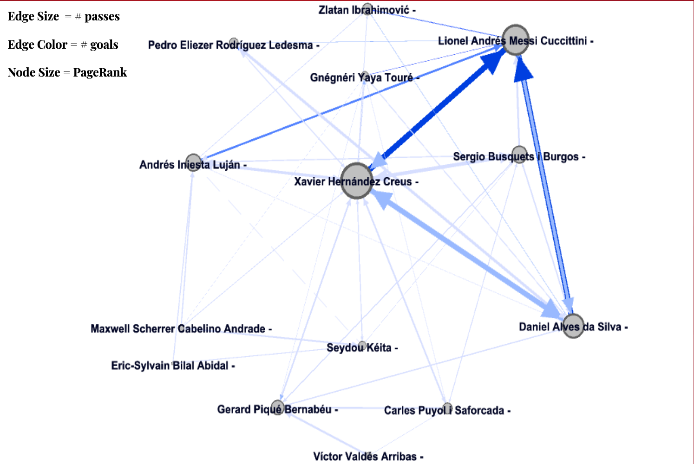
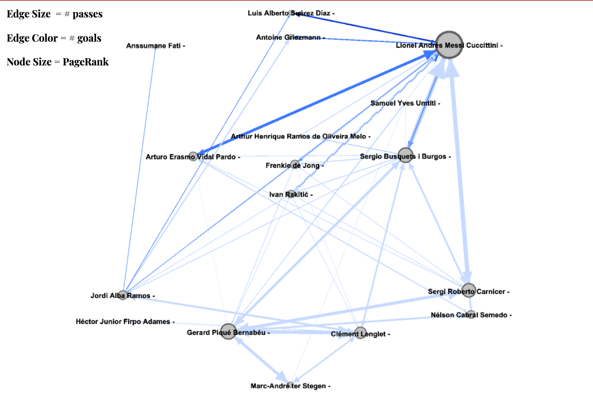
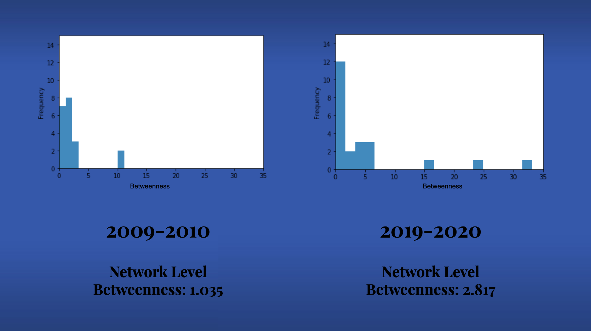

# Peak vs Weak: An FC Barcelona Case Study

## A Network Analytics Approach to Understanding FC Barcelona's Decline

### Background

* During the 09-10 campaign, Barcelona was arguably the best it has ever been as the team went on to win La Liga, the UEFA Super Cup, the FIFA Club World Cup, and the Supercopa all while scoring 98 goals in league play
* Comparatively, the 19-20 season saw Barça in possibly its worst form of the Messi era. This was a season where they didn’t win a single major competition and finished second in La Liga

### Objective

* Analyze how overall chemistry and composition of FC Barcelona has changed between the 2009-10 season and their worst season from 2019-20
* Identify trends in performance of star players and how their contribution has changed between seasons
* Generalize findings to recommend lineups and formations to managers

### Data

The data is obtained from the [Statsbomb Github](https://github.com/statsbomb/open-data/tree/master/data/events).

### Analysis

* Extracted directed passing and goal statistics from the data
  * Goals and assists added as attributes to nodes
  * Set threshold number of passes (20/100 passes)
* In Gephi:
  * Weighted edges using number of passes
  * Color-coded edges using number of goals
  * Ran PageRank to identify key players 
* Calculated centrality measures
* Regressed assists and goals on centrality measures

### Results

##### Visual network analysis of 2009-10:

##### Visual network analysis of 2019-20:

In 2009-10, the network is much more balanced although Messi is still responsible for most of the goals. In 2019-20, Messi has the largest PageRank by far, signaling an over-reliance on a star player.

##### Betweenness analysis of 2009-10:

A higher network level betweenness in 2019-20 score implies that there are a few very important players whereas a lower network level betweenness in 2009-10 implies that almost all players are involved in play. This is reinforced by the plots of individual betweenness scores.

##### Further Network Analysis

Results of closeness and centrality analyses can be found [here](img/barca_closeness.png) and [here](img/barca_centrality.png).

The largest clique in 2009-10 can be found [here](img/clique09.png). The largest clique in 2019-20 can be found [here](img/clique19.png). This seems to be a good method to find the most important/involved players on a team.

##### Can we predict goals accounted for?

Predicting "goals accounted for" would be valuable. We can try to use network statistics to do this. The regression output can be found [here](img/barca_regr.png). It appears that PageRank is the only significant predictor, but it is a very valuable predictor. The entire model explains over 63% of the variance in "goals accounted for".

### Takeaways for Barcelona

* Barcelona went from having 2-3 elite central presences to having nobody they could depend on in the middle
  * This is reinforced by the high PageRank scores of Xavi and Iniesta in 2009-10 and the low PageRank scores of all midfielders in 2019-20
* The left side has always been sparse but even more so in 2019-2020
  * It might be interesting to do further analysis for the years Barcelona had Neymar to see how the right side would change
* Is there life after Messi? The importance of Messi to Barcelona cannot be understated (see network statistics/visualizations)

### Implications for all Soccer Teams

* PageRank has been shown to be a valuable predictor of goals. It might be a great way to scout players and find attackers that will contribute.
* Finding the largest clique in a team seems to be a great way to find which players are most involved and important to the team's play
* Certain things not taken into account:
  * Defense: Network statistics do not capture any defensive statistics very well
  * Age/Development: Players like Fati in 2019-20 may have had low network scores but his potential is enormous

